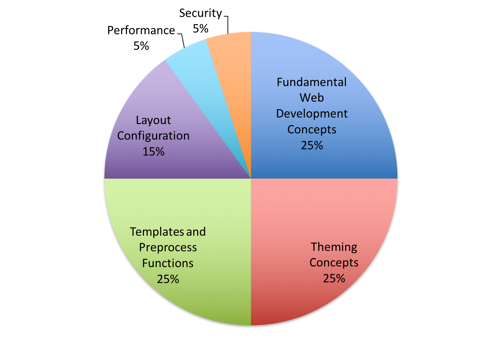

# Exam Domains

| Domain | % of Questions |
| :--- | :--- |
| 1.0 Fundamental Web Development Concepts | 25% |
| 2.0 Theming concepts | 25% |
| 3.0 Templates and Preprocess functions | 25% |
| 4.0 Layout configuration | 15% |
| 5.0 Performance | 5% |
| 6.0 Security | 5% |
| **TOTAL** | **100** |

_**Note:** This exam blueprint includes topics \/domains and test objectives to help guide the test taker. They should not be construed as a comprehensive listing of all of the content of this examination._

> Learn more about the Acquia Certification Program at [https://acquia.com/certification](https://acquia.com/certification)

