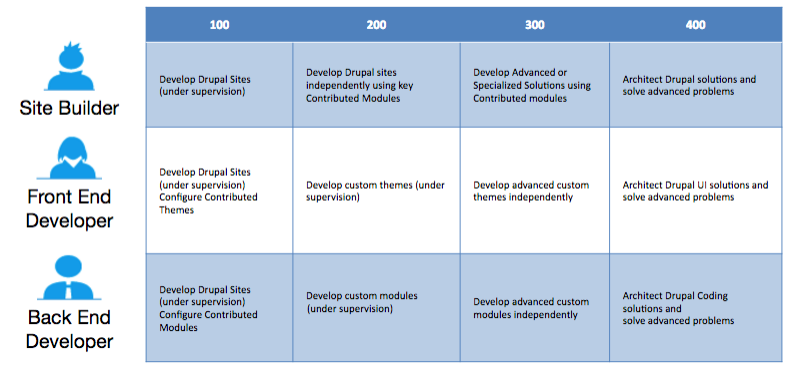

# Preparation

Once you have a list of topics for which you need preparation, you will possibly face two challenges.

1. Find and study documentation and knowledge resources for the topics and,
2. Find enough practical case studies covering the topics.

## 1. Knowledge Resources

Finding documentation and online resources is easier. You may register for Acquia Academy Courses and take a course in the relevant domain to refresh your knowledge.

A list of courses on Acquia Academy can be found at:[https://training.acquia.com/free-training](https://training.acquia.com/free-training). Depending on your area of weakness, you may wish to take one of the following courses:

* Building Websites with Drupal 8
* Drupal 8 Layout and Theming 

You can access these courses for free, and review them as many times as you like. Many Acquia Academy courses are available, and if you are in an Acquia enablement or training program, you have been assigned the courses required to obtain an initial certification.

Courses follow a model of 100-level for introductory material, 200-level for application of the concepts, 300-level for advanced concepts, and 400-level for solution architecture. Those with more exposure to Drupal 8 concepts, or with demonstrated site building experience with Drupal 7, may skip the D8 100-level courses.

We have also made a list of online resources and documentation for each learning domain in the [Study Guide](study-guide.md) section

## 2. Labs / Case Studies

The second challenge of finding enough practical case studies covering the topics is likely to be more daunting. Here are a few ideas and suggestions for finding finding case studies for your preparation:

### Site Building

Review several \(3-5\) Drupal 8 projects that you or your team has worked on in the past year. Review the content types, field settings, display settings, vocabularies, blocks, menus, and views used on the sites.

**Ask questions:**

* Why are the configurations the way they are?
* What can be changed or improved?
* What are the issues or support requests raised by the client?
* What changes were made to initial configurations and why?

### Front end development

Find custom themes developed by your team over the last year. If possible, obtain the source designs or wireframes on which they were based. Review template files and Twig syntax, review CSS and JS files, review pre-process functions implemented by the theme.

**Ask questions:**

* Is the theme implemented exactly as per the designs? If not, what changes were needed and why?
* Are theme regions optimal? Is there any redundancy?
* Which templates and template suggestions are used?
* Are there any theme settings?
* How are CSS and JS files called in the theme?
* Are there any preprocess functions used? Why?
* Which breakpoints are used? How adaptive design concepts are applied?
* If using a sub-theme, which properties from base theme are inherited and which are unique in sub-theme?
* Which Twig functions are used? 
* Are any custom display and view modes defined for entities and forms? How and where they are used?
* Were there any front-end performance issues? How they were handled? 

If you don't have access to themes developed by your team, you could do this exercise by examining a few [contributed themes](https://www.drupal.org/project/project_theme).

If you wish to sharpen your knowledge further, you could try building a theme on your own!

> Learn more about the Acquia Certification Program at [https://acquia.com/certification](https://acquia.com/certification)

