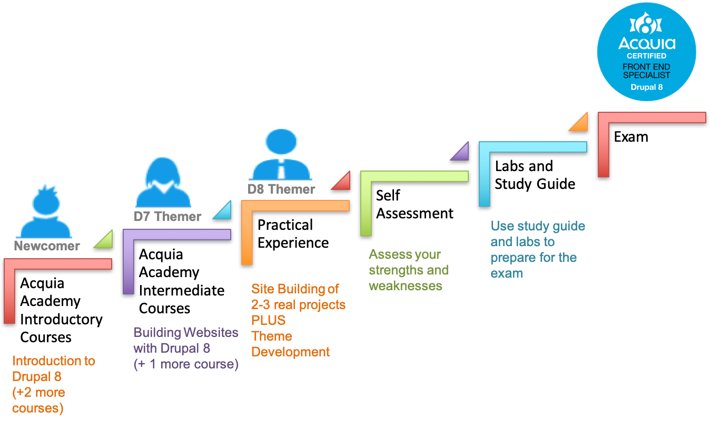

# Steps to Front End Specialist Certification

**Newcomer:** You are absolutely new to Drupal

**D7 Developer**: You have Drupal 7 Front end development experience, but new to Drupal 8

**D8 Developer**: You have Drupal 8 Front end development experience, wish to get certified.

## Take Acquia Academy Introductory Courses

As a Newcomer to Drupal 8, take introductory courses in Acquia Academy. We have three courses to get you started on your Drupal 8 journey.

* Introduction to Drupal 8
* Building a Basic Site Using Drupal 8
* Extending and Managing a Drupal 8 Site

After taking the courses, build a small website on your own to reinforce the concepts learned in the courses.

## Take Acquia Academy Intermediate Level Courses

For the Front end Developer path, the next step is to take two comprehensive 200 Level courses in Acquia Academy. The following courses are suggested:

* Building Websites with Drupal 8
* Drupal 8 Layout and Theming

If you have previous experience in Drupal 7 development, you should start here. The first course covers advanced site building concepts and in the second course theming concepts are covered from ground-up. The courses also contain hands-on exercises to help you build Drupal 8 based websites and themes.

You can access Drupal 8 preparatory courses on Acquia Academy, which you can find here:

[**https://acquiacademy.com**](https://acquiacademy.com)

You can access these courses for free and review them as many times as you like. Many of Acquia Academy courses are available, and if you are in an Acquia enablement or training program, you have been assigned the courses you most require to obtain an initial certification.

Courses follow a model of 100-level for introductory material, 200-level for application of the concepts, 300-level for advanced concepts, and 400-level for solution architecture.Those with more exposure to Drupal 8 concepts, or with demonstrated development experience with Drupal 7, may skip the D8 100-level courses.

## Gain Practical Experience

Completing the courses may not make you ready for taking the certification exam. You need to have some real-life practical experience to attempt the exam. For this purpose, we recommend that you gain the practical experience by working on at least 2-3 real life projects.

## Perform Self Assessment

Once you decide to take up the exam, we recommend that you study the domains and topics covered by the exam and their relative weightages. You should also perform a [Self Assessment](self-assessment.md) of your own areas of strengths and weaknesses vis-a-vis the domains/topics covered by the exam blueprint. This is a recommended starting point for experienced Drupal 8 Front end Developers.

## Use Labs and Study Guide

Based on your Self Assessment, you may need to gain knowledge and experience in some Domains or Topics. The best way to learn Drupal is by working or experimenting on it. Follow the suggestions given for preparation in the [Preparation](preparation.md) section and refer the external resources given in the [Study Guide](study-guide.md) section.

## Appear for Exam

At this stage, you should be ready to take the exam! Follow 'Schedule A Test' link on [http://acquia.com/certification.](http://acquia.com/certification)  
Register for the exam. You may choose from an online proctored or an onsite proctored exam delivery option.

> Learn more about the Acquia Certification Program at [https://acquia.com/certification](https://acquia.com/certification)

